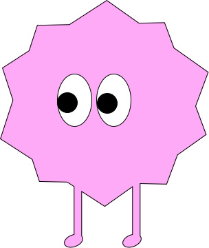
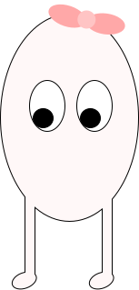
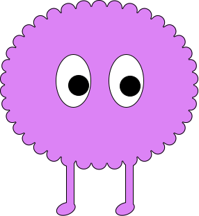

  

<h1 align="center"> Zebra — Web Puzzle</h1>

  An HTML/CSS/JS implementation of the famous Einstein's Riddle, a logic-based brain challenge!

---

### 🌐 Live Demo

You can try the riddle here:  
 [**GitHub Pages**](https://zebra-puzzle-ryvy.vercel.app/)

---

### 🧰 Tech Stack

- ✅ HTML
- ✅ CSS
- ✅ JavaScript
- 🎨 SVG illustration (custom-made!)

No frameworks, no libraries — just clean, responsive, semantic code. 

---
###  Author

**Stav Kdoshim**  
📧 stavkd04@gmail.com  
🔗 [LinkedIn](https://www.linkedin.com/in/stav-kdoshim/)

---

  This was a fun personal challenge to mix logic, design, and frontend development 🎯
