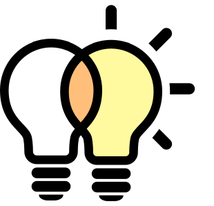
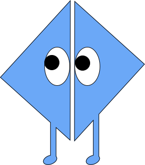
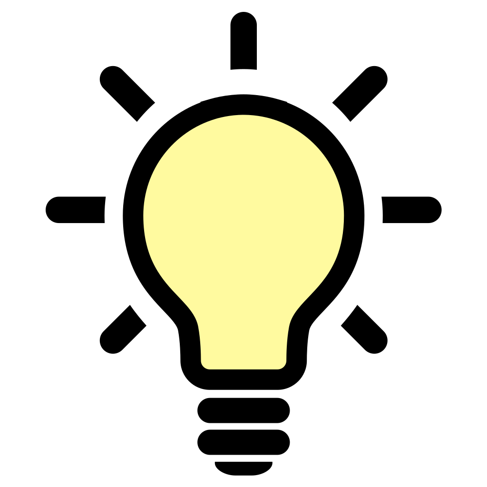
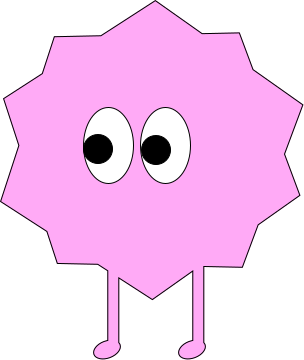
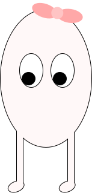
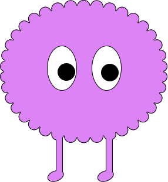
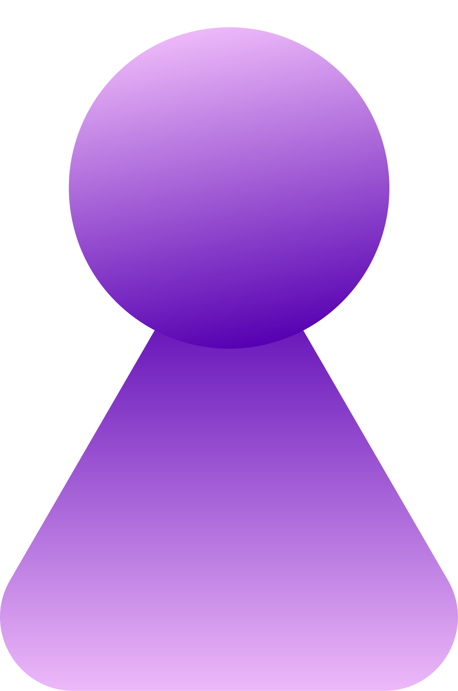

  

<h1 align="center">  Zebra and Light's Out a Linkedin Web Puzzles </h1>

  An HTML/CSS/JS implementation of Einstein's Riddle, a logic based challenge
  and a version to Light's Out puzzle, a strategy based challenge!

---

### Live Demo

You can try the riddle here:  
 [**PLAY HERE**](https://zebra-puzzle-ryvy.vercel.app/) 

---

### Tech Stack

- HTML
- CSS
- JavaScript
- SVG illustration (custom-made!)

No frameworks, no libraries — just clean, responsive code. 

---
###  Author

**Stav Kdoshim**  
📧 stavkd04@gmail.com  
🔗 [LinkedIn](https://www.linkedin.com/in/stav-kdoshim/)

---

  This was a fun personal challenge to mix logic, design, and frontend development 
